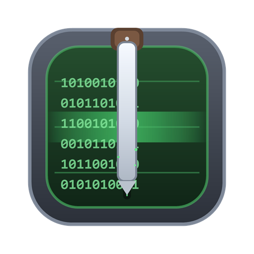

# FLAC-Chop





A small, cross-platform tool for **sample-exact cutting of RF-capture files**

(Ideally produced by the [MISRC-GUI](https://github.com/harrypm/MISRC-GUI) pipeline)

A Rust core reads the file metadata directly (no `soxi`/`ffprobe` shell-out) and
[SoX](https://sox.sourceforge.net/) performs the actual cut. The GUI is Qt6.

It correctly handles the things that trip up generic audio editors on these
files: the RF "20 kHz header = 20 MSPS real" convention, the 36-bit
`total_samples` wrap that long captures hit, and unfinalized/piped captures
whose FLAC header total is unknown.

## Supported input formats

| Input | Recognized by | Rate source |
|---|---|---|
| FLAC (`.flac`, `.ldf`, any file starting with the `fLaC` magic) | header + magic | header (RF /1000 rule applies) |
| PCM WAV (`.wav`) | header | header: audio rate as-is; >1 MHz = real RF rate; else /1000 |
| headerless raw PCM `.u8` `.u16` `.s8` `.s16` (also `.r8`/`.r16`/`.raw`/`.bin`) | extension | filename only: an `<n>msps` hint (e.g. `..._8-bit_20msps.u8`) is REQUIRED |

- Unknown extensions with a `fLaC` or `RIFF` magic header are detected by
  sniffing the first bytes of the file, so renamed captures just work.
- Raw PCM files have no header at all: the rate comes only from the filename
  (`..._20msps.u8` → 20 MSPS) and total samples from the file size. Without an
  `<n>msps` hint the probe refuses to guess.
- Raw files are treated as mono (cxadc/DdD RF convention) unless a channel
  count is set explicitly.
- Headerless raw RF is pinned to the same /1000 SoX stream rate as the
  equivalent FLAC, so sinc cutoffs and resample modes behave identically.


## Downloads


Downloads for Windows / MacOS / Linux X86 & ARM64 are under [Releases](https://github.com/harrypm/FLAC-Chop/releases)

Packaged release artifacts are self-contained: they bundle SoX and required
runtime libraries. You should not need to install SoX separately when using
release downloads.

If you build FLAC-Chop from source, SoX still needs to be available on PATH
(or via `FLAC_CHOP_SOX=/path/to/sox`).


## Features


- Real-time HH:MM:SS duration for RF captures, not the 1000×-wrong header value.
- Handles `total_samples` wrapping past 2³⁶ (recovers the true sample count).
- Reads the MISRC/DdD Vorbis tags (`RF_TOTAL_SAMPLES`, `RF_SAMPLE_RATE`,
  `DURATION_SECONDS`) as the authoritative in-file record.
- Falls back to a sibling `.log`/`.wav` for unfinalized captures, then to an
  exact FLAC frame-header scan.
- Surfaces non-fatal probe warnings (tag-unit corrections, Vorbis
  self-consistency mismatches, scan misalignment) in the GUI and on CLI stderr.
- Async probing — loading a 100 GB file doesn't freeze the window.
- IN / OUT markers via a single time box + Set IN / Set OUT buttons (ld-analyse
  style), with a dual-handle slider.
- Optional output processing modes for RF captures: keep source rate, or
  downsample to 20/24/28.6 MSPS (plus an experimental 16 MSPS mode), with
  wiki-aligned basic SoX sinc filter presets.
- Bit-depth control (keep source, 8-bit, or 6-bit crush emulation stored in an
  8-bit FLAC container; no dither — pure requantization for maximum
  compression efficiency and SNR).
- Headless `probe_cli` and `chop_cli` for scripting / validation.

## Using the GUI

1. **Browse** to a capture file — FLAC (`.flac`/`.ldf`), PCM WAV, or headerless
   raw PCM (`.u8`/`.u16`/`.s8`/`.s16`); any file with a matching magic header
   is accepted too. Drag-and-drop takes any local file and lets the probe
   decide (a clear error appears if the format is unsupported).
2. The probe runs on a background thread; the "Total (real)" label shows the
   real-time duration and a provenance tag (`vorbis RF_TOTAL_SAMPLES`,
   `companion file`, `scanned from frames`, or `wrap-corrected +N×2³⁶`). If
   the probe emitted non-fatal warnings (e.g. a tag-unit correction), a ⚠ with
   the details is appended to the label and shown in the status line.
3. Move the slider or type a time into the time box, then click **Set IN** /
   **Set OUT** to drop the IN (green) and OUT (red) markers. On load the
   handles sit at the start/end of the tape.
4. Click **Process**. FLAC-Chop writes `<input>-cut.flac` next to the source
   via `sox <in> <out> trim <start>s <len>s` (the `s` suffix = sample counts,
   so the cut is sample-exact at the real MSPS rate).

## Headless use

```bash
# probe a file (print sniffed format, real rate, total samples, real duration, provenance)
cargo run --release --manifest-path core/Cargo.toml --example probe_cli -- file.flac

# cut: chop_cli <in> <out.flac> <start_sec> <len_sec>
cargo run --release --manifest-path core/Cargo.toml --example chop_cli -- file.flac out.flac 60 10
```
The CLIs run the exact same probe → plan → SoX path as the GUI and accept the
same input formats. Headerless raw inputs must carry the rate in their name
(e.g. `..._8-bit_20msps.u8`).

## Status & Limitations

- No progress percentage during a cut (SoX doesn't emit sample progress to a
  captured pipe easily); the GUI shows a busy indicator instead.
- 6-bit RF output is emulated by pure bit-shift requantization to 6-bit
  precision stored in an 8-bit FLAC container, with no dither (SoX/FLAC
  cannot encode true 6-bit FLAC directly; dithering was removed as it adds
  incompressible noise and hurts compression efficiency and SNR).

## Author

© Harry Munday 2026 harry@opcomedia.com (therealharrypm - Discord) 
