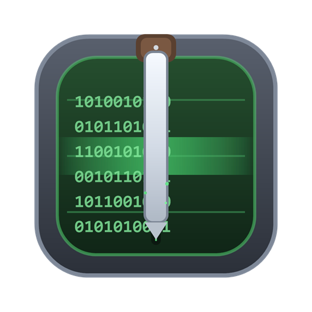

# FLAC-Chop





A cross-platform all-in-one tool for **sample-exact** cutting, bulk conversion, metadata editing, resampling, bit crushing and more for FM RF Archival captures!

Ideally using captures produced by the [MISRC-GUI](https://github.com/harrypm/MISRC-GUI) pipeline, it also has cross-integration with [tbc-tools](https://github.com/harrypm/tbc-tools/) for frame exact extraction and analysis use. 


## Downloads


Downloads for Windows / MacOS / Linux X86 & ARM64 are under [Releases](https://github.com/harrypm/FLAC-Chop/releases)


## Screenshots


## Building 

Packaged [release](https://github.com/harrypm/FLAC-Chop/releases) artifacts are self-contained: they bundle SoX and required
runtime libraries. 

You should not need to install SoX separately when using
release downloads however if you build FLAC-Chop from source, SoX still needs to be available on PATH
(or via `FLAC_CHOP_SOX=/path/to/sox`).


## Supported input formats


| Input | Recognized by | Rate source |
|---|---|---|
| Native FLAC (`.flac`, any file starting with the `fLaC` magic) | header + magic | header (RF /1000 rule applies) |
| **Ogg FLAC** (`.ldf`, `.oga`, `.raw.oga`, `.ogg` — any file starting with `OggS` + a FLAC mapping header) | magic, never the extension | header (RF /1000 rule applies); length from the last Ogg page |
| PCM WAV (`.wav`) | header | header: audio rate as-is; >1 MHz = real RF rate; else /1000 |
| headerless raw PCM `.u8` `.u16` `.s8` `.s16` (also `.r8`/`.r16`, the reversed `.8u`/`.8s`/`.16u`/`.16s`, and `.raw`/`.bin`/`.pcm`) | extension | filename only: an `<n>msps` hint (e.g. `..._8-bit_20msps.u8`) is REQUIRED |

- Unknown extensions with a `fLaC`, `OggS` or `RIFF` magic header are detected
  by sniffing the first bytes of the file, so renamed captures just work.

- **`.ldf` files are Ogg-wrapped FLAC** (decode's legacy`ld-compress` runs
  `ffmpeg … -acodec flac -f ogg`), not native FLAC. FLAC-Chop reads them with
  its own Ogg demuxer: the exact length comes from the last page's granule
  position (64-bit, so no 36-bit wrap, and correct even though a piped ffmpeg
  write leaves STREAMINFO `total_samples` = 0), and a cut losslessly remuxes
  only the pages it needs into a temporary native FLAC (frame bytes are copied,
  frame numbers rebased, CRCs recomputed — nothing is re-encoded) that the
  normal SoX pipeline then trims. This works with the bundled SoX, which has no
  Ogg support. The temp file is written next to the output (falling back to the
  system temp dir) and is removed afterwards; it is only as large as the cut.
  Cuts are always written as native `.flac`, whatever the input container.

- Clear errors instead of a generic failure: non-FLAC Ogg (Vorbis/Opus/…), a
  headerless packed `.lds`, and an ID3v2-prefixed FLAC each get a message that
  says what the file is and what to do.

- Ogg FLAC metadata is read-only in the Metadata Editor tab (Ogg header packets
  cannot be rewritten in place); the cut output is a native FLAC whose tags are
  editable.

- Raw PCM files have no header at all: the rate comes only from the filename
  (`..._20msps.u8` → 20 MSPS) and total samples from the file size. Without an
  `<n>msps` hint the probe refuses to guess.

- Raw files are treated as mono (cxadc/DdD RF convention) unless a channel
  count is set explicitly.

- Headerless raw RF is pinned to the same /1000 SoX stream rate as the
  equivalent FLAC, so sinc cutoffs and resample modes behave identically.


## Features


It correctly handles the things that trip up generic audio editors on these
files: the RF "20 kHz header = 20 MSPS real" convention, the 36-bit
`total_samples` wrap that long captures hit, and unfinalized/piped captures whose FLAC header total is unknown.

A Rust core reads the file metadata directly (no `soxi`/`ffprobe` shell-out) and
[SoX](https://sox.sourceforge.net/) performs the actual cut. The GUI is Qt6.

- Real-time HH:MM:SS duration for RF captures, not the 1000×-wrong header value.

- Handles `total_samples` wrapping past 2³⁶ (recovers the true sample count).

- Reads the MISRC/DdD Vorbis tags (`RF_TOTAL_SAMPLES`, `RF_SAMPLE_RATE`,
  `DURATION_SECONDS`) as the authoritative in-file record.

- Falls back to a sibling `.log`/`.wav` for unfinalized captures, then to an
  exact FLAC frame-header scan.

- Surfaces non-fatal probe warnings (tag-unit corrections, Vorbis
  self-consistency mismatches, scan misalignment) in the GUI and on CLI stderr.

- Async probing — loading a 100 GB file doesn't freeze the window.

- IN / OUT markers via a single time box + Set IN / Set OUT buttons (ld-analyse
  style), with a dual-handle slider.

- Optional output processing modes for RF captures: keep source rate, or
  downsample to 10 (HiFi FM) / 16 / 20 / 24 / 28.6 MSPS, with wiki-aligned
  basic SoX sinc filter presets.

- Bit-depth control (keep source, 8-bit, true **12-bit FLAC** output, or 6-bit
  crush emulation stored in an 8-bit FLAC container; no dither — pure
  requantization for maximum compression efficiency and SNR).

- **Batch Task tab**: multi-file queue with parallel whole-file processing
  (up to one worker per CPU thread), per-file status, Stop, skip-existing or
  overwrite, and per-input output naming (ported from tbc-tools
  ld-lds-converter's batch model).

- Headless `probe_cli` and `chop_cli` for scripting / validation.

- Self-healing FLAC headers: when a capture's STREAMINFO `total_samples` was
  never finalized (some MISRC HiFi writers store the real count / 1000), the
  true count is recovered from the `RF_TOTAL_SAMPLES` Vorbis tag and the
  header is repaired in place before cutting — without it SoX refuses every
  cut past the mis-declared end.

- Cut outputs are validated (a SoX run that exits 0 but writes a header-only
  file is a hard failure) and the cut's RF Vorbis tags are rewritten to the
  new altered metadata **in place** — the same method the MISRC-GUI recorder
  uses (grow the comment into adjacent padding / trim the vendor string), so
  no temp file and no full-file rewrite is ever needed. Files that cannot fit
  get a full verified splice that leaves 4096 bytes of padding behind (the
  old lofty-based writer was dropped: its FLAC writer corrupts files).

## Using the GUI

1. **Browse** to a capture file — FLAC (`.flac`), Ogg FLAC (`.ldf`/`.oga`), PCM WAV, or headerless
   raw PCM (`.u8`/`.u16`/`.s8`/`.s16`, also `.r8`/`.r16`/`.8u`/`.8s`/`.16u`/`.16s`/`.raw`/`.bin`/`.pcm`);
   any file with a matching magic header is accepted too. Drag-and-drop takes
   any local file and lets the probe decide (a clear error appears if the
   format is unsupported).

2. The probe runs on a background thread; the "Total (real)" label shows the
   real-time duration and a provenance tag (`vorbis RF_TOTAL_SAMPLES`,
   `companion file`, `scanned from frames`, or `wrap-corrected +N×2³⁶`). If
   the probe emitted non-fatal warnings (e.g. a tag-unit correction), a ⚠ with
   the details is appended to the label and shown in the status line.

3. Move the slider or type a time into the time box, then click **Set IN** /
   **Set OUT** to drop the IN (green) and OUT (red) markers. On load the
   handles sit at the start/end of the tape.

4. Click **Process**. FLAC-Chop writes `<input>-cut.flac` next to the source
   via `sox <in> <out> trim <start>s <len>s` (the `s` suffix = sample counts,
   so the cut is sample-exact at the real MSPS rate).

## Using the Batch Task tab

The **Batch Task** tab (ported from tbc-tools ld-lds-converter's batch model)
processes many capture files with the same output settings:

1. **Add…** files (multi-select), or drop several files anywhere on the window
   (a single dropped file still loads into the Chop tab for marker cuts).
   Duplicate paths are ignored; **Remove selected** / **Clear** edit the queue.

2. Pick the output settings (mode / bit-depth / sinc filter) and an optional
   output directory — empty means each input file's own folder. Every queued
   file is processed **whole** (start → end), i.e. batch re-compression, not
   marker cuts (use the Chop tab for those).

3. **Parallel processing** (on by default) runs up to one job per CPU thread
   concurrently; each job runs on a worker thread either way, so the window
   never freezes and **Stop** always works (running jobs are cancelled, files
   not yet started are skipped, partial outputs are cleaned up).

4. Per-file status is shown in the queue (Queued / Working… / Done / Failed
   with the reason / Cancelled / Skipped — output already exists). A file whose
   rate is below the selected output mode (or that is not an RF capture)
   fails individually with that reason; the rest of the batch continues.

5. Existing outputs are skipped by default (re-runs are idempotent); tick
   **Overwrite existing outputs** to replace them. Two queued files that map
   to the same output name get `_2`, `_3` suffixes so they never overwrite
   each other.

## Headless use

```bash
# probe a file (print sniffed format, real rate, total samples, real duration, provenance)
cargo run --release --manifest-path core/Cargo.toml --example probe_cli -- file.flac

# cut: chop_cli <in> <out.flac> <start_sec> <len_sec>
cargo run --release --manifest-path core/Cargo.toml --example chop_cli -- file.flac out.flac 60 10

# cut + convert: chop_convert_cli <in> <out> <start_sec> <len_sec> <out_rate_khz|0=keep> <out_bits|0=source> [filter 0/1]
# e.g. cut to 10 MSPS (HiFi FM) 6-bit with the sinc profile:
cargo run --release --manifest-path core/Cargo.toml --example chop_convert_cli -- file.flac out.flac 60 10 10000 6 1
```
The CLIs run the exact same probe → plan → SoX path as the GUI and accept the
same input formats. Headerless raw inputs must carry the rate in their name
(e.g. `..._8-bit_20msps.u8`).

## Command-line usage

The main binary doubles as a full headless CLI (no window opens for any
non-GUI argument form). It reuses the exact FFI path the GUI uses, so it
doubles as a smoke/automation harness for the whole cut pipeline.

```
flac-chop <in> <out.flac|dir> <start> <len>
          [--units samples|seconds] [--rate 10000|16000|20000|24000|28600]
          [--bits 8|12|6] [--no-filter]
flac-chop --probe <in> [--json]
flac-chop --gui [<file>] [--in <pos>] [--out <pos>] [--units samples|seconds]
flac-chop --version
```

- `<in>`: FLAC (`.flac`/`fLaC` magic), Ogg FLAC (`.ldf`/`.oga`/`OggS` magic), PCM WAV, or headerless raw PCM
  (`.u8`/`.u16`/`.s8`/`.s16`/`.r8`/`.r16`/`.8u`/`.8s`/`.16u`/`.16s`/`.raw`/`.bin`/`.pcm`;
  raw needs an `<n>msps` filename hint).

- `<out>`: a full `.flac` output path OR a directory. A directory gets a
  renamed stem reflecting the chosen rate/bits (MISRC convention:
  `<base>_<B>-bit_<N>msps`, e.g. `tape_8-bit_20msps` cut to 16 MSPS 6-bit
  becomes `tape_6-bit_16msps-cut.flac`), with `-2`, `-3`, … clobber avoidance.

- `<start>`/`<len>`: real seconds (default) or exact sample counts with
  `--units samples`. Seconds mode is unchanged from earlier releases
  (back-compat). Samples mode takes **exact integer real RF sample counts** —
  the same units as vhs-decode metadata `fileLoc` — passed 1:1 to the cutter
  and clamped to the probed end of the file exactly like second-derived
  counts.

- `--rate <kHz>`: output header rate (the /1000 MSPS convention values:
  10000/16000/20000/24000/28600). With `--no-filter` the wiki-aligned basic
  sinc profile is skipped; by default it is applied to the matching preset.

- `--bits`: `8`, `12` (true 12-bit FLAC output — see below), or `6` (6-bit
  grid in an 8-bit container, no dither). Omit to keep the source precision.

- `--probe <in> [--json]`: prints the probe report; `--json` emits stable
  snake_case JSON covering every probe field (including `warnings` as an
  array, `format`, `is_rf`, `msps`) — stable for scripting/automation.

- `--gui [<file>] [--in <pos>] [--out <pos>] [--units samples|seconds]`:
  launches the GUI pre-loaded with `<file>` and the IN/OUT markers set from
  `--in`/`--out` (interpreted per `--units`). A bare positional file
  (`flac-chop file.flac`) opens the GUI pre-loaded the same way.

Exit codes: `0` = ok, `1` = pipeline error (reason on stderr), `2` = usage
error.

### True 12-bit FLAC output

`--bits 12` writes a **true 12-bit FLAC** — STREAMINFO `bits_per_sample = 12`,
signed samples on the [-2048, 2047] grid — per the MISRC/HdSDAOH capture
standard. No command-line encoder can produce this (the `flac` CLI rejects
`--bps 12`, SoX warns it "can't encode to 12-bit", and ffmpeg silently
upgrades to 24-bit), so FLAC-Chop encodes the 12-bit stream itself: the cut
runs through SoX into a 16-bit temp FLAC (12-bit samples left-justified ×16),
then a second pass decodes it sample-exactly, shifts every sample back onto
the 12-bit grid (`>>4`), and writes the true 12-bit FLAC. A 12-bit → 12-bit
cut round-trips **sample-exact**, validated against the `claxon` decoder, the
reference `flac` CLI decoder, and ffprobe in the test suite.

Two SoX 12-bit limitations the pipeline works around (they are properties of
SoX, not of the files):

- **SoX cannot READ true 12-bit FLAC at all** (`sox_precision` only accepts
  byte-aligned bit depths: 8/16/24/32 — verified on SoX 14.4.2 with
  libFLAC-written 12-bit files). A 12-bit source is therefore fed to SoX as a
  raw signed 16-bit stream on stdin (decoded with claxon, left-justified ×16 —
  byte-for-byte what SoX would have read from the equivalent 16-bit FLAC),
  so every cut of a 12-bit capture (the main MISRC case) works: to 12/16/8/6
  bits and/or any rate conversion.
- A plain trim of a 12-bit source (no conversion requested, "keep source
  precision") skips SoX entirely and runs decode → trim → re-encode in Rust,
  since SoX can neither read nor write 12-bit FLAC.

## Status & Limitations

- No progress percentage during a cut (SoX doesn't emit sample progress to a
  captured pipe easily); the GUI shows a busy indicator instead.
- 6-bit RF output is emulated by pure bit-shift requantization to 6-bit
  precision stored in an 8-bit FLAC container, with no dither (SoX/FLAC
  cannot encode true 6-bit FLAC directly; dithering was removed as it adds
  incompressible noise and hurts compression efficiency and SNR).

## Author

© Harry Munday 2026 harry@opcomedia.com (therealharrypm - Discord) 
